# Use Fiddler to Capture EDP-RT Content

## Introduction

EDP-RT (Elektron Data Platform for Real Time) is a solution for applications to access Elektron Real Time content via Cloud technologies. To use EDP-RT, developers need to implement an application with REST API for authentication and WebSocket API for Real Time content. With these technologies, accessing the Real Time content from Cloud is quite easy. However, when observing problems, such as connection lost, incorrect content, or unexpected behaviors, the application should be able to provide enough information in order to investigate the issue. The common information required for investigation is message tracing. Typically, there are three methods to trace the messages.

1. Implement a tracing capability inside the application by logging all messages sent and recieved through REST API and WebSocket API
2. Enable tracing in the REST and WebSocket API libraries (However, the used libraries must support tracing)
3. Use a proxy to capture the incoming and outgoing messages

This article demonstates the third method by using Fiddler as a proxy to capture all incoming and outgoing messages from REST and WebSocket APIs. It also shows how to modify the examples to connect to EDP-RT through the Fiddler proxy.

## Table of centens
* Fiddler
>* Configure Fiddler
* Modify Examples to Use a Fiddler as a Proxy
>* Python
>* CSharp
>* Java
* View Fiddler Output
* Save Fiddler Output
* Conclusion


## Fiddler
Fiddler is an web debugger proxy server application which can be used to captures HTTP(S) and Web Socket traffic and log it for reviewing. It is a free tool which can be downloaded from [https://www.telerik.com/fiddler](https://www.telerik.com/fiddler). This article uses Fiddler version 5.0 for Windows. 

## Configure Fiddler

If you don't have installed Fiddler on the machine, please downlod Fiddler from [https://www.telerik.com/fiddler](https://www.telerik.com/fiddler), and then install it. This section demonstrates how to:

1. Configure Fiddler to decrypt the HTTP(S) traffic
2. Export and convert the Fiddler Root certificate file
3. Remove the Fidder Root certificate

### **1. Configure Fiddler to decrypt the HTTPS traffic**

Typically, Fiddler can capture the HTTP(S) traffic passed through itself. However, the client may be unable to understand the data if the traffic has been encrypted. Fiddler can be configured to install the Fidder Root certificate to intercept the HTTPS traffic and decrypt the data. Please follow these steps to configure Fiddler to capture and decrypt HTTP(S) traffic. 


> * Run Fiddler application
> * Click **Tools -> Options...** from the menu
> * On the HTTPS tab, check both **Capture HTTPS CONNECTs** and **Decrypt HTTPS traffic** boxes

>>> 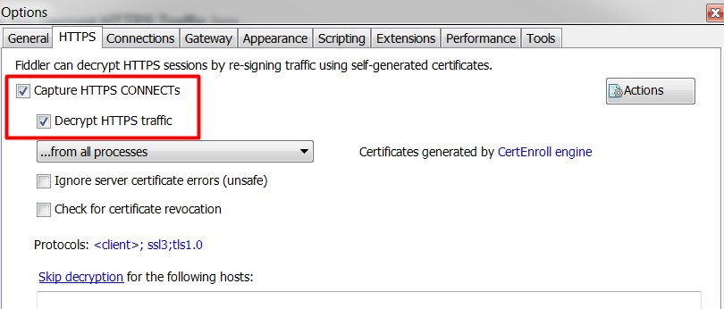

> * For the first setup, the dialog box may appear to inform about generating and trusting the Fidder Root certificate. Click the **Yes** button 

>>> 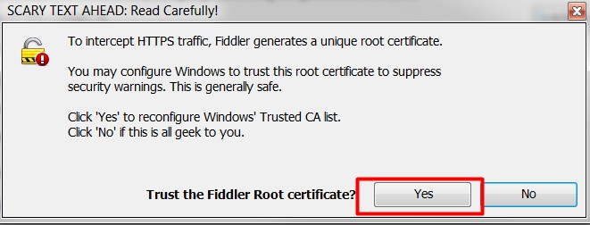

> * Click the **Yes** button again to install this certificate to the Windows certificate store

>>> 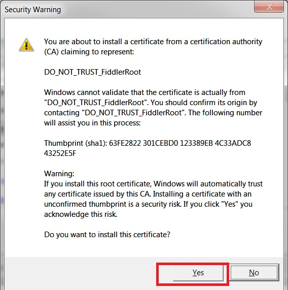


> * Click the **Connections** tab to verify the TCP port listened by Fiddler. The default port is 8888. Then click the **OK** button to close the Options window

>>> 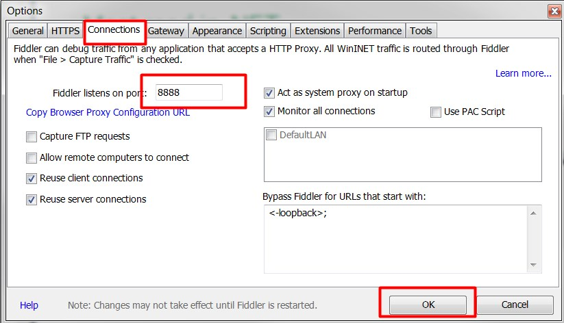

> * Click **File** from the menu and verify that **Capture Traffic** is checked

>>> 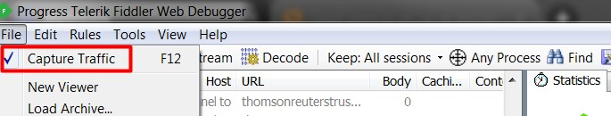

>> After these steps, the Fidder Root certificate has been added to the Windows certificate store. You can run the **certmgr.msc** command to verify the Fiddler Root certificate.

>> 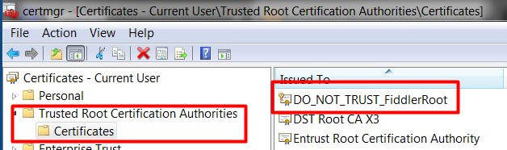 


### **2. Export and convert the Fiddler Root certificate file**

For some programming languages, the Fiddler Root certifiate file is required when creating an encrypted connection through the Fiddler proxy. For example, in Python, the Fiddler Root ceritifate file is required when sending post requests and creating a web socket connection through the Fiddler proxy. For Java, the Fiddler Root certificate must be imported to the Jave key store file. For .NET programming languages, this step can be ignored because the Fiddler Root certificate has already been imported to the Windows certificate store from the previous steps.

Please follow these steps to export and convert the Fiddler Root certificate file to a format which can be used by Python and Java.

> * Run Fiddler application
> * Click **Tools -> Options...** from the menu
> * On the HTTPS tab, click the **Actions** button and select **Export Root Certificate to Desktop** to export the Fiddler Root certificate file to Desktop. The file **FiddlerRoot.cer** will be saved on the Desktop. 

>>> 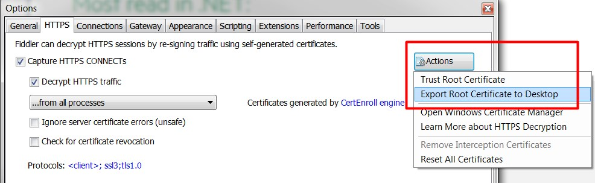

* Click the **OK** button to close the Options window

> * Open the **Command Prompt** and run the following command to convert the Fiddler Root certificate file to the PEM standard. You can download the openssl binaries from [OpenSSL Binaries](https://wiki.openssl.org/index.php/Binaries)

>> ```
>> openssl x509 -inform DER -in FiddlerRoot.cer -out FiddlerRoot.crt
>> ```

The created **FiddlerRoot.crt** will be used in the following steps. 

### **3. Remove the Fidder Root certificate**

After capturing the traffic, you may need to rmoeve the installed Fiddler Root certificate from the Windows certificate store. Please follow these steps to remove the Fidder Root certificate.

> * Run Fiddler application
> * Click **Tools -> Options...** from the menu
> * On the HTTPS tab, uncheck the **Decrypt HTTPS traffic** box

>>> 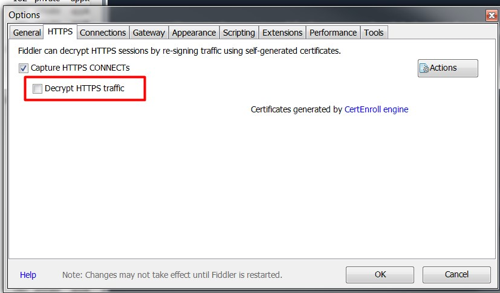

> * Click the Actions button and then select **Remove Interception Certificates**
>>> 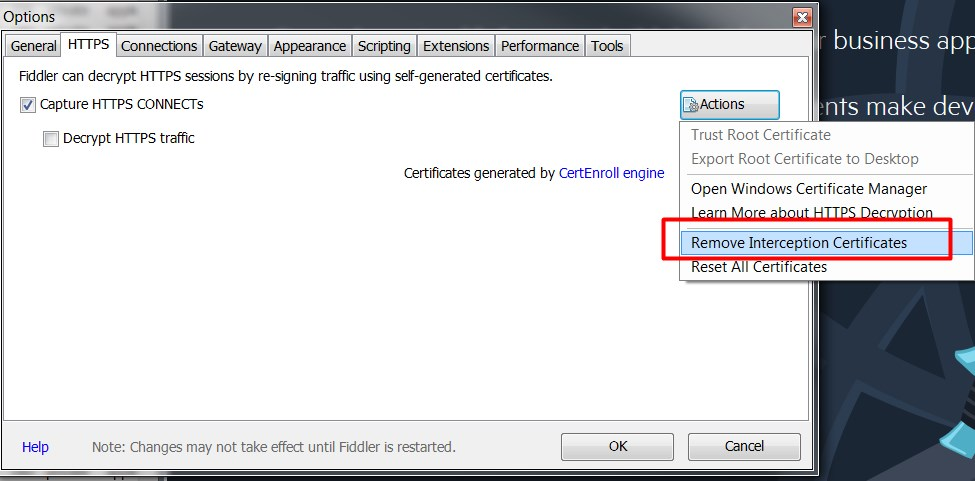

> * Click the **Yes** button to confirm to delete the Fiddler Root certificate
>>> 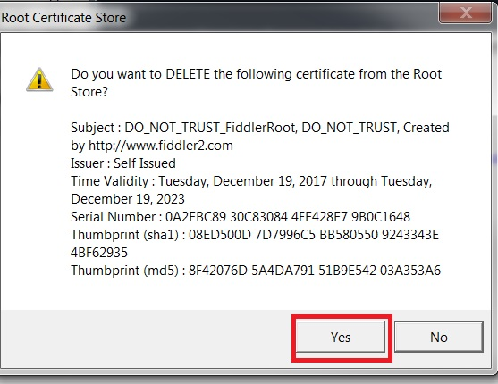

* Click the **OK** button to close the **Options** window

Then, you can run the **certmgr.msc** command to verify that the Fiddler Root certificate has been removed from the Trusted Root Certification Authorities

## Modify Examples to Use a Fiddler as a Proxy

The CSharp, Java, and Python examples for connecting to EDP-RT are available in the [GitHub](https://github.com/Refinitiv/websocket-api/tree/master/Applications/Examples/EDP). They are console applications with commandline arguments. This section demonstrates how to modify the examples to connect to EDP-RT through a proxy. In this section, the hostname and TCP port of a Fiddler proxy is 127.0.0.1:8888 and the certificate file is **FiddlerRoot.crt** created in the previous step.

The examples will be modifed in the following points:

1. Setting a proxy when sending HTTP(S) post and get requests for authentication, token refresh, and service discovery
2. Setting a proxy when creating a web socket connnetion for getting market data

### Python
There are two examples in the Python folder. 

* The **market_price_edpgw_authentication.py** example demonstrates authenticating via an HTTPS request to the EDP-RT Gateway using a username and password. It then opens a WebSocket to the ERT service using the specified hostname, logs in with the retrieved token, and requests market content.

* The **market_price_edpgw_service_discovery.py** example demonstrates authenticating via an HTTPS request to the EDP Gateway using a username and password, and discovering endpoints of the EDP-RT service via an HTTPS request to EDP-RT Service Discovery. The example then opens a WebSocket to an endpoint, logs in with the retrieved token, and requests market content

Please follow these steps to modify the examples to connect to EDP through a Fiddler proxy.

1. In the **get_sts_token** function of both examples, modify the **requests.post** function call to use a proxy and cerificate file by using the **proxies** and **verify** arguments.

```python
        r = requests.post(url,
                          headers={'Accept': 'application/json'},
                          data=data,
                          auth=(user, client_secret),
                          verify="FiddlerRoot.crt",
                          proxies={
                              'http':'http://127.0.0.1:8888',
                              'https':'http://127.0.0.1:8888'
                              })  
```
> The value of the **verify** argument is the location of the certificate file. In this case, the **FiddlerRoot.crt** file is in the working directory of the examples. The value of the **proxies** argument is a proxy setting for the HTTP(S) connection. 

2. In both examples, modify the code when running the web socket on a new thread by using the following **kwargs** arguments.

```python
        wst = threading.Thread(target= ...,
                               kwargs={
                                   'http_proxy_host':'127.0.0.1',
                                   'http_proxy_port':'8888',
                                   'sslopt':{'ca_certs':'FiddlerRoot.crt'}
                                   })
```
> The **kwagrs** parameter has the **http_proxy_host** and **http_proxy_port** arguments which contain the proxy host and port settings, and the **ca_certs** arguement which contain the location of certificate file. In this case, the **FiddlerRoot.crt** file is in the working directory of the examples

3. In the **market_price_edpgw_service_discovery.py** example,  modify the **requests.get** function call in the **query_service_discovery** function to use a proxy and cerificate file by using the **proxies** and **verify** arguments.

```python
        r = requests.get(url, 
                         headers={"Authorization": "Bearer " + sts_token}, 
                         params={"transport": "websocket"},
                         verify="FiddlerRoot.crt",
                         proxies={
                             'http':'http://127.0.0.1:8888',
                             'https':'http://127.0.0.1:8888'
                             })
```
> The value of the **verify** argument is the location of the certificate file. In this case, the **FiddlerRoot.crt** file is in the working directory of the examples. The value of the **proxies** argument is a proxy setting for the HTTP(S) connection. 

I have modified The Python examples to connect through a proxy. The new optional arguments with default values are introduced for proxy settings and a certificate file. 

|Arguement Name|Description|Default Value|
|--------------|-----------|-------------|
|--proxy_host|The hostname or IP address of the proxy|127.0.0.1|
|--proxy_port|The TCP port listened by the proxy|8888|
|--cert_file|The certificate file used by the proxy|FiddlerRoot.crt|

The modified examples are available in ....


### C#
There are two examples in the CSharp folder. 

* **MarketPriceEdpGwAuthenticationExample**: Retrieves market-price content for TRI.N after authenticating with an authentication server and using tokens sent by that server to keep the connection alive

* **MarketPriceEdpGwServiceDiscoveryExample**: Retrieves market-price content for TRI.N after authenticating with an authentication server and using tokens sent by that server to keep the connection alive and after using service discovery to find the location of the service providing the market-price content

Please follow these steps to modify the examples to connect to EDP through a Fiddler proxy.

1. In both examples, create a new WebProxy object with the proxy settings. 

```csharp
WebProxy proxyObject = new WebProxy("http://127.0.0.1:8888/");
```

2. In the **GetAuthenticationInfo** method of both examples, assign the created **WebProxy** object (**proxyObject**) to the **Proxy** property of the **HttpWebRequest**

```csharp
HttpWebRequest webRequest = (HttpWebRequest)WebRequest.Create(url);
webRequest.Proxy = proxyObject;
```
3. In both examples, assign the created **WebProxy** object (**proxyObject**) to the **Options.Proxy** property of the **ClientWebSocket** object

```csharp
 WebSocket = new ClientWebSocket();
 WebSocket.Options.Proxy = proxyObject;
```
4. In the **MarketPriceEdpGwServiceDiscoveryExample** example, assign the created **WebProxy** object (**proxyObject**) to the **Proxy** property of the **HttpWebRequest** in the **DiscoverServices** method

```csharp
HttpWebRequest webRequest = (HttpWebRequest)WebRequest.Create(url);
webRequest.Proxy = proxyObject;
```
C# examples don't require a certificate file because the WebSocket and web request libraries used by .NET programming languages can acquire the cerificates installed in the Windows certificate store. Therefore, there is no need to specify it in the examples.

I have modified The C# examples to connect through a proxy. The new optional arguments with default values are introduced for proxy settings.

|Arguement Name|Description|Default Value|
|--------------|-----------|-------------|
|--proxy_host|The hostname or IP address of the proxy|127.0.0.1|
|--proxy_port|The TCP port listened by the proxy|8888|

The modified examples are available at ....

### Java
There are two examples in the Java folder. 

* The **MarketPriceEdpGwAuthentication** example demonstrates authenticating via an HTTPS request to the EDP-RT Gateway using a username and password. It then opens a WebSocket to the ERT service using the specified hostname, logs in with the retrieved token, and requests market content.


* The **MarketPriceEdpGwServiceDiscovery** example demonstrates authenticating via an HTTPS request to the EDP Gateway using a username and password, and discovering endpoints of the EDP-RT service via an HTTPS request to EDP-RT Service Discovery. The example then opens a WebSocket to an endpoint, logs in with the retrieved token, and requests market content

Please follow these steps to modify the examples to connect to EDP through a Fiddler proxy.

1. In both examples, create a new **HttpHost** object with the proxy settings and then build a custom **RequestConfig** with this proxy

```java
HttpHost proxy = new HttpHost("127.0.0.1", 8889, "http");
RequestConfig config = RequestConfig.custom()
   .setProxy(proxy)
   .build();
```
2. In the **GetAuthenticationInfo** method of both examples, assign the created **RequestConfig** object (**config**) to the **HttpPost** object via the **setConfig** method

```java
HttpPost httppost = new HttpPost(url);		
httppost.setConfig(config);

```
3. In both examples, configure a proxy setting of the created **WebSocketFactor** object

```java
WebSocketFactory factory = new WebSocketFactory();
factory.getProxySettings().setServer("http://127.0.0.1:8888");		
```

4. In both examples, remove the code that adds a **PERMESSAGE_DEFLATE** extension when creating a websocket

```java
_websocket = websocketFactory.createSocket(_url)
   .addProtocol("tr_json2")
   .addListener(new WebSocketAdapter() 
   {
    ...                              
   });
   //.addExtension(WebSocketExtension.PERMESSAGE_DEFLATE);
```
If the **PERMESSAGE_DEFLATE** extension isn't removed, the WebSocket data shown in the Fiddler will be compressed. 

5. In the **queryServiceDiscovery** method of the **MarketPriceEdpGwServiceDiscovery** example, assign the created **RequestConfig** object (**config**) to the **HttpGet** object via the **setConfig** method

```java
HttpGet httpget = new HttpGet(new URIBuilder().setScheme("https").setHost(host).setPath(discoveryPath).setParameter("transport", "websocket").build());
httpget.setConfig(config);
```

Before running the examples, the Fiddler Root certificate must be imported to the Java KeyStore. Typically, the Java KeyStory file (cacerts) is in the **JAVA_HOME\jre\lib\security\cacerts** directory. The following command can be used to import the Fiddler Root certificate file.

```
C:\Program Files\Java\jdk1.8.0_131\jre\lib\security>keytool -import -alias fiddl
er -file FiddlerRoot.crt -keystore cacerts  -storepass changeit

```

The **FiddlerRoot.crt** file was created in the previous step (Export and convert the Fiddler Root certificate file). 

The Fiddler Root certificate can be removed from the Java KeyStore with the following command.

```
C:\Program Files\Java\jdk1.8.0_131\jre\lib\security>keytool -delete -alias fiddler -keystore cacerts -storepass changeit
```

I have modified the Java examples to connect through a proxy. The new optional arguments with default values are introduced for proxy settings.

|Arguement Name|Description|Default Value|
|--------------|-----------|-------------|
|--proxy_host|The hostname or IP address of the proxy|127.0.0.1|
|--proxy_port|The TCP port listened by the proxy|8888|

The modified examples are available at ....

## View Fiddler Output

After configuring the Fiddler and modifing the examples to connect through the Fiddler, you can view the incoming and outgoing messages via the Fiddler application. When connecting to EDP-RT, you can view the following information.

**1. Authentication and Refresh Token**

The host and URL for authentication and refresh token is api.edp.thomsonreuters.com:443 and /auth/oauth3/beta1/token, respectively. You can use **Edit -> Find Sessions ...** (Ctrl+F) to find this session.

Double click on the session to view the request and response messages. The decrypted request and response messages are displayed on the right panel.

For example:

**Authentication**
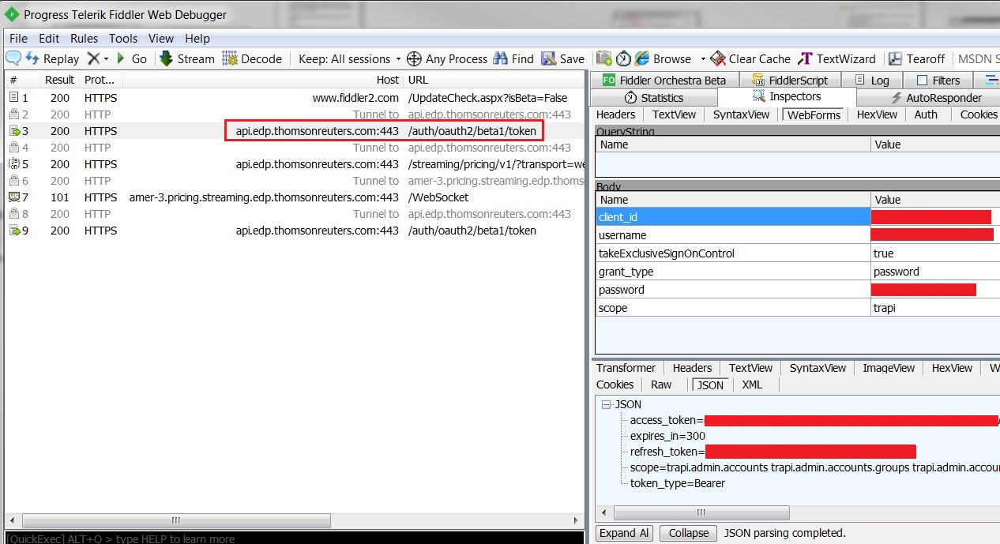

**Refresh Token**
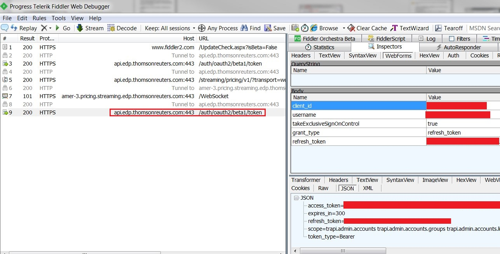

**2. Service Discovery**

The host and URL for authentication and refresh token is api.edp.thomsonreuters.com:443 and /streaming/pricing/v1/?transport=websocket, respectively. You can use **Edit -> Find Sessions ...** (Ctrl+F) to find this session.

Double click on the session to view the request and response messages. The decrypted request and response messages are displayed on the right panel.

For example:
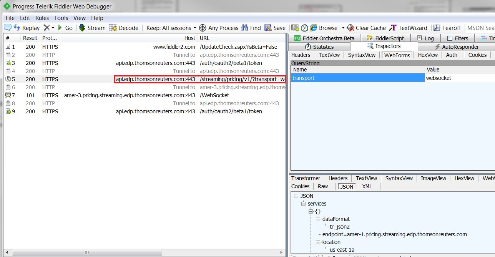

**4. Real-time Data via WebSocket**
The hostname for the streaming real-time data may depend no the configuration or service discovery. It looks like amer-3.pricing.streaming.edp.thomsonreuters.com:443. The URL is /WebSocket.
You can use **Edit -> Find Sessions ...** (Ctrl+F) to find this session.

Double click on the session to view the request and response messages. The decrypted messages are displayed in the **WebScoket** tab on the right panel.

For example:
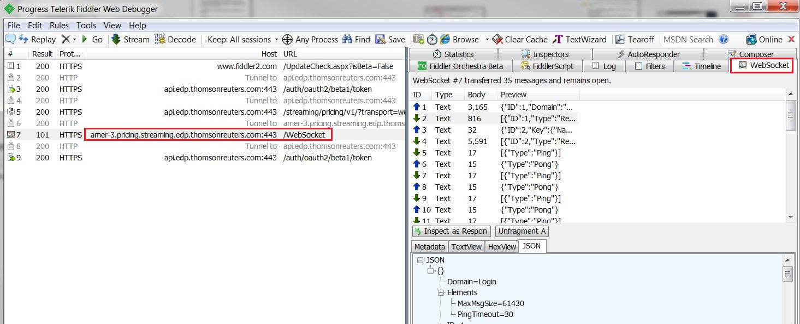

## Save Fiddler Output
The output of the selected session can be saved by right clicking on the selected session. Then select** Save -> Selected Sessions -> in ArchiveZip...**


The file type is Session Archive (.saz). The archived file can be re-opened via the Fiddler application by selecting the **File -> Load Archive...** menu.

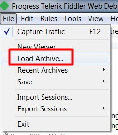


## Conclusion
This article demonstrates how to configure the Fiddler to capture the data when connecting to EDP-RT. It exaplains how to modify the examples to connect to EDP-RT via the Fiddler proxy.

The captured data can be decryped and displayed on the Fiddler application. Moreover, it can be saved as a session archive, and then reopened via the Fiddler applcation. 

## References
1. [Fiddler](https://www.telerik.com/fiddler)
2. [Fiddler Wiki](https://en.wikipedia.org/wiki/Fiddler_(software))
3. [Configure Fiddler to Decrypt HTTPS Traffic](http://docs.telerik.com/fiddler/Configure-Fiddler/Tasks/DecryptHTTPS)


